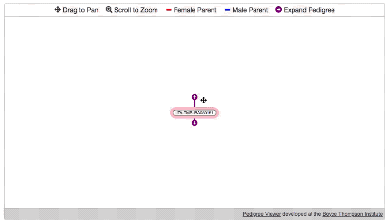

# [BrAPI](https://github.com/plantbreeding/API) Pedigree Viewer [](https://github.com/solgenomics/BrAPI-Pedigree-Viewer/releases) [](https://github.com/solgenomics/BrAPI-Pedigree-Viewer/releases)
- Try it out [here](https://solgenomics.github.io/BrAPI-Pedigree-Viewer/example)
- Include-ready version can be found under [releases](https://github.com/solgenomics/BrAPI-Pedigree-Viewer/releases).
- Also available via npm: `npm install @solgenomics/brapi-pedigree-viewer` 



### Usage

##### Uses BrAPI v1.2

First, create a PedigreeViewer object:
```js
var server = "https://brapi.myserver.org/brapi/v1", //REQUIRED, brapi root url, NO trailing slash.
    auth = {username:'myname', password:'mysecret'}, //OPTIONAL object containing key/value BrAPI authentication params (null or undefined for no auth)
    sgn_url = function(germplasmDbId){ //OPTIONAL a function which returns a link to a germplasm information page, returning null will create a node without a link.
        return "https://brapi.myserver.org/germ/"+germplasmDbId+".html";
    };
var pdg = PedigreeViewer(server, auth, sgn_url);
```
Then, draw the viewer:
```js
var initial_germplasm = "1234", //REQUIRED single germplasmDbId which should be displayed on start (highlighted in pink)
    dom_parent_selector = "div#pdgv-wrap", //REQUIRED selector for the parent node of the new viewer SVG element.
    width = 800, //OPTIONAL width of viewer
    height = 400; //OPTIONAL height of viewer
pdg.newTree(initial_germplasm, function(){
    // this callback is called once the new tree has been initialized.
    pdg.drawViewer(dom_parent_selector, width, height); // only draw the tree once the new tree has been initialized!
});
```

### Requirements
- [@solgenomics/brapijs](https://github.com/solgenomics/BrAPI.js)
- [D3.js](https://github.com/d3/d3) (v4)
- [d3-pedigree-tree](https://github.com/solgenomics/d3-pedigree-tree)
#### Requirements for the Example
- [@solgenomics/brapp-wrapper](https://github.com/solgenomics/BrApp-Wrapper) (For building the example.)
- [jQuery](https://github.com/jquery/jquery) (v3) (For the forms in the example.)
