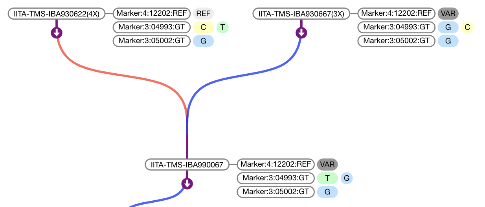

# [BrAPI](https://github.com/plantbreeding/API) Pedigree Viewer [](https://github.com/solgenomics/BrAPI-Pedigree-Viewer/releases) [](https://github.com/solgenomics/BrAPI-Pedigree-Viewer/releases)
- Try it out [here](https://solgenomics.github.io/BrAPI-Pedigree-Viewer/example)
- Include-ready version can be found under [releases](https://github.com/solgenomics/BrAPI-Pedigree-Viewer/releases).
- Also available via npm: `npm install @solgenomics/brapi-pedigree-viewer` 


## Usage

The pedigree viewer exposes a minimal API for initializing and populating the tree. It relies on BrAPI to fetch the pedigree data it uses. 

### Initializing the tree

Use the following snippets (in order) to fully set up a tree.

1. Create a new PedigreeTree object (create one for each pedigree tree viewer)
    ```js
    var pdg = PedigreeViewer(
      //REQUIRED Server: BrAPI.js handle for target endpoint
      BrAPI("https://brapi.myserver.org/brapi/v1"),
      //OPTIONAL a function which returns a link to a germplasm information page, returning null will create a node without a link.
      function(germplasmDbId){ 
          return "https://brapi.myserver.org/germ/"+germplasmDbId+".html";
      }
    );
    ```
2. Then, specify the root node and load the initial data.
    ```js
    pdg.newTree(
      //REQUIRED root germplasmDbId of germplasm which should be displayed on start (highlighted in pink)
      "1234"
    )
    ```
3. Last, tell the viewer where to draw.
    ```js
    pdg.drawViewer(
      //REQUIRED selector for the parent node of the new viewer SVG element.
      "div#pdgv-wrap", 
      //OPTIONAL width of viewer
      800, 
      //OPTIONAL height of viewer
      400
    );
    ```
4. (Optional) Provided function to retrieve phenotype/marker data to display. (See the next section.)

### Displaying Marker/Phenotype Data

Use the `pdg.data(accessor)` method to display marker or phenotype data. Data is displayed as a table to the right of each node in the tree. `accessor` should be a function which takes a germplasmDbId returns an array or Promise which will resolve to an array in the following format:
```js
// Example of data accessor return value
[
  {
    "name":"DS", // Unique name for data row
    "values":[ // Array of data values to display in row
      {
        "value":"0", // Text to display as data value
        "color":"#EEE" // background color of data value
      },...
    ]
  },...
]
```
#### Simple Data Example

```js
// Source example
pdg.data(function(germplasmDbId){
    return [
        {name:"germplasmDbId",values:[
            {value:germplasmDbId,color:"#ffb3ba"}
        ]}
      ]
  })    
```

#### Realistic Data Example

```js
// Source example
pdg.data(function(germplasmDbId){
    return fetch(`https://mysite.com/api/marker_data/${germplasmDbId}`)
      .then(resp=>resp.json())
      .then(data=>data.markers);
      /*
        data.markers: [{
          "name": "Marker:4:12202:REF",
          "values": [{
            "value": "REF",
            "color": "#eeeeee"
          }]
        }, {
          "name": "Marker:3:04993:GT",
          "values": [{
            "value": "T",
            "color": "#baffc9"
          }, {
            "value": "A",
            "color": "#ffb3ba"
          }]
        }, {
          "name": "Marker:3:05002:GT",
          "values": [{
            "value": "A",
            "color": "#ffb3ba"
          }]
        }]
      */
  })    
```

## Requirements
- [@solgenomics/brapijs](https://github.com/solgenomics/BrAPI.js) (Peer Requirement)
- [D3.js](https://github.com/d3/d3) (v4) (Peer Requirement, expected to be in scope)
- [d3-pedigree-tree](https://github.com/solgenomics/d3-pedigree-tree)
#### Requirements for the Example
- [@solgenomics/brapp-wrapper](https://github.com/solgenomics/BrApp-Wrapper) (For building the example.)
- [jQuery](https://github.com/jquery/jquery) (v3) (For the forms in the example.)
